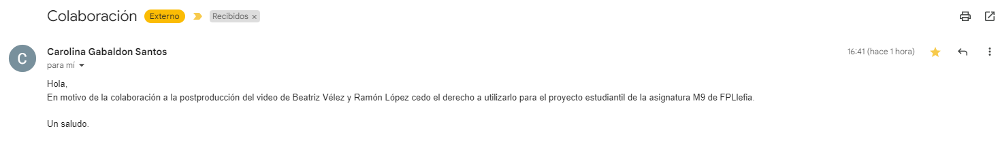

# M9 - UF2 - Elementos Multimedia

Para la página se han utilizado elementos de [Pixabay](https://pixabay.com/es/service/license-summary/) y [Freepik](https://support.freepik.com/s/topic/0TO3V000000Cla4WAC/licenses?language=es).

Los elementos en cuestión son:
 - https://pixabay.com/es/videos/misterio-niebla-miedo-halloween-38127/
 - https://pixabay.com/es/photos/hormig%C3%B3n-pared-oscuro-sombr%C3%ADo-933563/
 - https://pixabay.com/es/music/metal-tell-us-green-man-127804/
 - https://www.freepik.es/vector-gratis/logo-redondo-remolino-medio_40499945.htm#fromView=search&term=smoke+logo&track=ais&regularType=vector&page=1&position=0&uuid=45d4609f-b781-4900-b170-4e32526a83d8

Los elementos de video han sido postproducidos por Beatriz Vélez y [Carolina Gabaldón](https://www.instagram.com/dannakasuna/?hl=es) quien ha dado su consentimiento para poder utilizar el vídeo:

Para la subida de archivos se han optimizado imágenes, videos y audios.

Finalmente, para la web se ha trabajado con el [CDN de Tailwind](https://tailwindcss.com/docs/installation/play-cdn)

